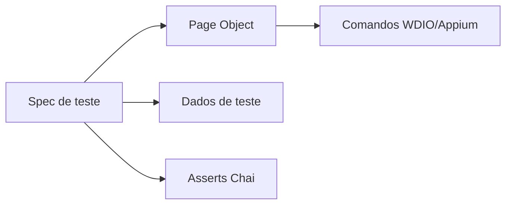

# Guia WebDriverIO + Appium (Mobile)

Este documento é um **README técnico focado em WebDriverIO com Appium**, com passo a passo de instalação, configuração, comandos principais, modelagem do projeto e boas práticas para automação mobile.


## 1) Visão geral da stack

- **Framework de automação:** WebDriverIO
- **Driver mobile:** Appium
- **Runner de testes:** Mocha
- **Asserts:** Chai
- **Relatórios:** Allure
- **Execução local:** Android Emulator / iOS Simulator
- **Execução cloud (opcional):** BrowserStack

---

## 2) Pré-requisitos

### Obrigatórios

- Node.js 18+ (recomendado Node 20 LTS)
- npm
- Java JDK (para ecossistema Android)
- Android Studio (SDK + emulador)

### Para iOS (somente macOS)

- Xcode
- iOS Simulator

### Para cloud (opcional)

- Conta BrowserStack

---

## 3) Estrutura recomendada do projeto

```text
mobile_webdriverio_js/
├── app/
│   ├── android/
│   │   └── android.wdio.native.app.v2.2.0.apk
│   └── ios/
│       └── ios.simulator.wdio.native.app.v2.2.0.zip
├── config/
│   ├── wdio.shared.conf.js
│   ├── wdio.android.local.conf.js
│   ├── wdio.ios.local.conf.js
│   └── wdio.browserstack.conf.js
├── tests/
│   ├── specs/
│   ├── pageobjects/
│   ├── helpers/
│   └── data/
├── reports/
│   ├── allure-results/
│   └── screenshots/
├── logs/
├── .env
├── .gitlab-ci.yml
└── package.json
```

---

## 4) Passo a passo: instalação e configuração

## 4.1 Inicializar projeto Node

```bash
npm init -y
```

## 4.2 Instalar dependências de automação

```bash
npm install --save-dev @wdio/cli @wdio/local-runner @wdio/mocha-framework @wdio/spec-reporter @wdio/allure-reporter @wdio/appium-service @wdio/browserstack-service appium allure-commandline chai dotenv
```

## 4.3 Configurar Appium localmente

Instalar Appium (se ainda não estiver disponível globalmente):

```bash
npm install -g appium
```

Instalar drivers do Appium:

```bash
appium driver install uiautomator2
appium driver install xcuitest
```

> Observação: `xcuitest` exige macOS/Xcode.

## 4.4 Configurar variáveis de ambiente

Arquivo `.env` (já existe no projeto):

```env
BROWSERSTACK_USERNAME=YOUR_BROWSERSTACK_USERNAME
BROWSERSTACK_ACCESS_KEY=YOUR_BROWSERSTACK_ACCESS_KEY
BROWSERSTACK_APP_URL=bs://YOUR_APP_ID
TEST_ENV=local
```

## 4.5 Configurar arquivos WDIO

Arquivos já preparados:

- `config/wdio.shared.conf.js` → configurações comuns (reporter, hooks, timeout, etc.)
- `config/wdio.android.local.conf.js` → capabilities Android local com APK
- `config/wdio.ios.local.conf.js` → capabilities iOS local com app zip
- `config/wdio.browserstack.conf.js` → execução em nuvem (BrowserStack)

### Onde a instância `driver` é criada

A instância do `driver` não é criada manualmente nos testes com `new` ou `remote()`. Ela é criada automaticamente pelo **WebdriverIO Local Runner** quando um comando `wdio run` é executado, por exemplo:

```bash
npm run test:android
```

Esse script executa `config/wdio.android.local.conf.js`. O WebdriverIO inicia o serviço Appium configurado em `services`, lê as `capabilities` e cria uma sessão WebDriver com o Appium:

```js
services: [
	['appium', {
		logPath: path.resolve(__dirname, '../logs')
	}]
],
port: 4723,
capabilities: [{
	platformName: 'Android',
	'appium:automationName': 'UiAutomator2',
	'appium:app': path.resolve(__dirname, '../app/android/android.wdio.native.app.v2.2.0.apk')
}]
```

Depois que a sessão é criada, o WebdriverIO disponibiliza globalmente os objetos `driver` e `browser`. Por isso os testes podem chamar diretamente métodos como:

```js
await driver.reloadSession()
await driver.activateApp('com.wdiodemoapp')
```

O `reloadSession()` encerra a sessão atual e solicita uma nova sessão ao Appium; ele não é necessário para criar a primeira sessão, pois essa etapa é feita automaticamente pelo runner antes da execução dos testes.

---

## 5) Principais comandos

## Instalação de dependências

```bash
npm install
```

## Executar testes Android local

```bash
npm run test:android
```

## Executar testes iOS local

```bash
npm run test:ios
```

## Executar testes no BrowserStack

```bash
npm run test:browserstack
```

## Gerar e abrir relatório Allure

```bash
npm run report:allure
```

## Iniciar Appium manualmente (opcional)

```bash
npx appium server --address 127.0.0.1 --port 4723 --log-level info
```

## Configurar o Appium Inspector

O arquivo `config/appium-inspector.android.json` contém as capabilities Android do projeto em formato JSON para importar ou copiar no Appium Inspector.

No Appium Inspector, configure:

- **Remote Host:** `127.0.0.1`
- **Remote Port:** `4723`
- **Remote Path:** `/`
- **Capabilities:** conteúdo de `config/appium-inspector.android.json`

Exemplo das capabilities:

```json
{
	"platformName": "Android",
	"appium:automationName": "UiAutomator2",
	"appium:deviceName": "moto g86 5G",
	"appium:platformVersion": "16",
	"appium:udid": "ZF525KTJ77",
	"appium:app": "D:\\GitHub\\mobile_webdriverio_js\\app\\android\\android.wdio.native.app.v2.2.0.apk",
	"appium:autoGrantPermissions": true,
	"appium:forceAppLaunch": true,
	"appium:shouldTerminateApp": true,
	"appium:newCommandTimeout": 180
}
```

As capabilities acima já estão configuradas para o dispositivo local do projeto (`moto g86 5G`, Android `16`, UDID `ZF525KTJ77`). Se o UDID mudar, obtenha o novo valor com `adb devices` e atualize `appium:udid`.

### Exemplo usando emulador Android

Para usar um emulador em vez do dispositivo físico, remova `appium:udid` e informe o nome do AVD em `appium:deviceName`. Por exemplo:

```json
{
	"platformName": "Android",
	"appium:automationName": "UiAutomator2",
	"appium:deviceName": "Pixel_3a_XL",
	"appium:platformVersion": "16",
	"appium:app": "D:\\GitHub\\mobile_webdriverio_js\\app\\android\\android.wdio.native.app.v2.2.0.apk",
	"appium:autoGrantPermissions": true,
	"appium:forceAppLaunch": true,
	"appium:shouldTerminateApp": true,
	"appium:newCommandTimeout": 180
}
```

Liste os emuladores disponíveis com:

```bash
emulator -list-avds
```

Inicie o AVD escolhido antes de iniciar a sessão no Appium Inspector:

```bash
emulator -avd Pixel_3a_XL
```

O valor de `appium:deviceName` deve ser exatamente o nome retornado por `emulator -list-avds`, e `appium:platformVersion` deve corresponder à versão Android da imagem instalada no AVD.

Inicie o Appium antes de clicar em **Start Session** no Inspector. Não execute simultaneamente o serviço Appium do WebdriverIO na mesma porta `4723`, pois isso causa conflito entre os servidores.

---

## 6) Modelagem da automação (Page Object)

Objetivo: separar **regra de interação de tela** da **regra de teste**, facilitando manutenção e escalabilidade.

## Camadas

1. **Specs (`tests/specs`)**
	- Descrevem o cenário de negócio
	- Não devem conter seletor direto (evitar acoplamento)

2. **Page Objects (`tests/pageobjects`)**
	- Encapsulam elementos e ações da tela
	- Ex.: login, cadastro, navegação, formulário

3. **Helpers (`tests/helpers`)**
	- Funções utilitárias: leitura de dados, screenshots customizados, waits reutilizáveis

4. **Data (`tests/data`)**
	- Massas para testes data-driven (JSON/CSV)

## Fluxo recomendado



---

## 7) Padrão de escrita de Page Object

### Boas práticas de PO

- Um Page Object por tela (ou componente relevante)
- Métodos com nomes de intenção de negócio (`loginWith`, `submitForm`)
- Evitar lógica condicional complexa dentro do spec
- Reutilizar métodos comuns via `base.page.js`

### Exemplo de estrutura

```text
tests/pageobjects/
├── base.page.js
├── login.page.js
├── signup.page.js
├── home.page.js
├── navigation.page.js
└── forms.page.js
```

---

## 8) Boas práticas gerais (WebDriverIO + Appium)

1. **Seletores estáveis primeiro**
	- Priorizar `accessibility id` (mobile)
	- Evitar XPath frágil quando possível

2. **Sincronização confiável**
	- Usar `waitForDisplayed`, `waitForEnabled`, `waitUntil`
	- Evitar `pause` fixo

3. **Testes independentes**
	- Cada cenário deve poder rodar isoladamente
	- Resetar estado quando necessário

4. **Evidência automática em falha**
	- Screenshot no `afterTest`
	- Centralizar em `reports/` e `logs/`

5. **Dados externos (data-driven)**
	- Separar massa em `tests/data`
	- Cobrir positivos e negativos

6. **Confiabilidade em CI/CD**
	- Timeouts consistentes
	- Execução previsível por ambiente

7. **Clareza dos cenários**
	- Nomear testes com padrão: `CXX - descrição`

### 8.1 Localização de elementos mobile

No WebdriverIO, os elementos são localizados com `$` para um elemento e `$$` para uma coleção de elementos. Em aplicações nativas, o Appium traduz esses seletores para os mecanismos de localização do Android ou iOS.

```js
const loginButton = await $('~button-LOGIN')
const formFields = await $$('android.widget.EditText')
```

#### Principais estratégias

**Accessibility ID** é a estratégia preferencial para elementos mobile porque costuma ser rápida, estável e compartilhada entre Android e iOS:

```js
const emailInput = await $('~input-email')
await emailInput.setValue('qa@example.com')
```

O prefixo `~` representa um `accessibility id`. No Android, normalmente corresponde ao atributo `content-desc`; no iOS, ao identificador de acessibilidade.

**ID ou resource-id** pode ser usado quando o aplicativo expõe um identificador nativo:

```js
const emailInput = await $('id=com.example.app:id/input-email')
```

**Classe nativa** localiza elementos pelo tipo de widget. É útil como fallback, mas pode retornar vários elementos:

```js
const inputs = await $$('android.widget.EditText')
await inputs[0].setValue('qa@example.com')
```

**UiSelector** permite combinar propriedades específicas do Android:

```js
const loginButton = await $('android=new UiSelector().text("LOGIN")')
```

**XPath** permite combinar atributos e hierarquia. Deve ser usado com moderação, pois tende a ser mais lento e frágil:

```js
const loginButton = await $('//*[@content-desc="button-LOGIN"]')
const errorMessage = await $('//*[@text="Please enter a valid email"]')
```

Em iOS, também podem ser utilizados Predicate String e Class Chain:

```js
const loginButton = await $('-ios predicate string:name == "button-LOGIN"')
const emailInput = await $('-ios class chain:**/XCUIElementTypeTextField[`name == "input-email"`]')
```

Boas práticas para seletores:

- Priorize `accessibility id` (`~id-do-elemento`).
- Evite seletores baseados em texto que pode mudar por idioma.
- Evite XPath absoluto, como `/hierarchy/.../element[3]`.
- Centralize seletores nos Page Objects, nunca diretamente nos specs.
- Use `$$` somente quando realmente precisar trabalhar com uma coleção.

### 8.2 Tipos de espera no WebdriverIO

As esperas devem aguardar uma condição real do aplicativo, em vez de depender de tempos fixos. O timeout padrão do projeto é definido por `waitforTimeout` na configuração do WebdriverIO.

#### `waitForExist`

Aguarda o elemento existir na árvore da tela. O elemento pode ainda não estar visível:

```js
const feedback = await $('~feedback-message')
await feedback.waitForExist({ timeout: 10000 })
```

#### `waitForDisplayed`

Aguarda o elemento existir e estar visível para o usuário:

```js
const loginButton = await $('~button-LOGIN')
await loginButton.waitForDisplayed({ timeout: 15000 })
await loginButton.click()
```

#### `waitForEnabled`

Aguarda um controle estar habilitado antes da interação:

```js
const submitButton = await $('~button-SIGN UP')
await submitButton.waitForEnabled({ timeout: 10000 })
await submitButton.click()
```

#### `waitForClickable`

Aguarda o elemento estar disponível para clique. Em telas mobile, `waitForDisplayed` combinado com `waitForEnabled` costuma ser mais explícito:

```js
const continueButton = await $('~button-CONTINUE')
await continueButton.waitForClickable({ timeout: 10000 })
await continueButton.click()
```

#### `waitUntil`

Permite aguardar uma condição personalizada, como a mudança de texto ou de tela:

```js
await browser.waitUntil(
	async () => {
		const result = await $('~input-text-result')
		return (await result.getText()).includes('Mensagem QA')
	},
	{
		timeout: 15000,
		interval: 500,
		timeoutMsg: 'O resultado do formulário não foi atualizado'
	}
)
```

Também é possível usar os matchers do WebdriverIO quando o projeto estiver configurado para eles:

```js
await expect($('~feedback-message')).toBeDisplayed()
await expect($('~feedback-message')).toHaveText(expect.stringContaining('sucesso'))
```

#### `pause`

`browser.pause(ms)` interrompe a execução por um tempo fixo. Deve ser usado apenas quando não existe uma condição observável melhor, pois deixa o teste mais lento e instável:

```js
await browser.pause(1000)
```

Prefira sempre uma espera condicional:

```js
await $('~feedback-message').waitForDisplayed({ timeout: 10000 })
```

#### Espera reutilizável no Page Object

Para evitar repetição, uma classe base pode encapsular a espera e a interação:

```js
async function tapWhenReady(selector, timeout = 15000) {
	const element = await $(selector)
	await element.waitForDisplayed({ timeout })
	await element.waitForEnabled({ timeout })
	await element.click()
}
```

Em resumo: use `waitForExist` para presença, `waitForDisplayed` para visibilidade, `waitForEnabled` ou `waitForClickable` antes de interagir e `waitUntil` para condições de negócio ou transições específicas. 

---

## 9) Estratégia de modelagem dos cenários

Para cobertura inicial mobile, separar por domínio:

- **Autenticação**: login/cadastro e validações
- **Navegação**: transição entre telas e retorno
- **Formulários**: preenchimento, envio, mensagens de erro

Critério prático:

- Smoke: cenários críticos de fluxo feliz
- Regressão: fluxos alternativos e negativos

---

## 10) Configuração de relatórios e evidências

- Reporter `allure` configurado em `wdio.shared.conf.js`
- Screenshots em falha via hook `afterTest`
- Geração do relatório:

```bash
npm run report:allure
```

---

## 11) Execução por ambiente

### Android local

- App sob teste: `app/android/android.wdio.native.app.v2.2.0.apk`
- Arquivo de config: `config/wdio.android.local.conf.js`

### iOS local e CI/CD

- App sob teste: `app/ios/wdiodemoapp.app` (Bundle Identifier: `org.wdiodemoapp`)
- Arquivo de config: `config/wdio.ios.local.conf.js`
- Suporte a injetar o UDID do dispositivo/simulador dinamicamente via `IOS_UDID`
- Suporte nativo a seletores iOS (`-ios predicate string`, `accessibility id` `~`, `XCUIElementTypePickerWheel`)
- Geração automática de evidências de falha (`reports/screenshots/*.png` e `reports/page-sources/*.xml`)
- Requer macOS + Xcode + driver Appium `xcuitest`

### BrowserStack (opcional)

- Definir credenciais no `.env`
- Arquivo de config: `config/wdio.browserstack.conf.js`

---

## 12) Troubleshooting rápido

### Appium não inicia

- Validar instalação: `appium -v`
- Confirmar drivers: `appium driver list --installed`

### Sessão não cria no Android

- Verificar emulador iniciado
- Validar `platformVersion`, `deviceName` e caminho do APK

### Relatório Allure não abre

- Confirmar execução de testes antes
- Confirmar existência de `reports/allure-results`

---

## 13) Próximos passos recomendados

1. Implementar os métodos `TODO` dos Page Objects
2. Implementar asserts com Chai nos 10 cenários
3. Expandir massa de dados JSON para cobertura negativa
4. Refinar pipeline GitLab para gatilhos por branch/MR

---

Se quiser, no próximo passo eu transformo este guia em duas versões:

- **Quick Start (1 página)** para onboarding rápido
- **Guia Completo** para manutenção do framework

---

## 14) Exemplos reais de código (WebDriverIO + Appium)

> Abaixo estão exemplos funcionais em JavaScript ESM para usar com a estrutura deste projeto.

### 14.1 Configuração compartilhada (`config/wdio.shared.conf.js`)

```js
import path from 'node:path'
import { fileURLToPath } from 'node:url'
import dotenv from 'dotenv'

dotenv.config()

const __filename = fileURLToPath(import.meta.url)
const __dirname = path.dirname(__filename)

export const sharedConfig = {
	runner: 'local',
	specs: ['./tests/specs/**/*.spec.js'],
	maxInstances: 1,
	logLevel: 'info',
	waitforTimeout: 15000,
	connectionRetryTimeout: 120000,
	connectionRetryCount: 2,
	framework: 'mocha',
	mochaOpts: {
		ui: 'bdd',
		timeout: 120000
	},
	outputDir: path.resolve(__dirname, '../logs'),
	reporters: [
		'spec',
		['allure', {
			outputDir: path.resolve(__dirname, '../reports/allure-results'),
			disableWebdriverStepsReporting: true,
			disableWebdriverScreenshotsReporting: false,
			addConsoleLogs: true,
			reportedEnvironmentVars: {
				TEST_ENV: process.env.TEST_ENV || 'local'
			}
		}]
	],
	afterTest: async function (_test, _context, { error }) {
		if (error) {
			await browser.takeScreenshot()
		}
	}
}
```

### 14.2 Configuração Android local (`config/wdio.android.local.conf.js`)

```js
import path from 'node:path'
import { fileURLToPath } from 'node:url'
import { sharedConfig } from './wdio.shared.conf.js'

const __filename = fileURLToPath(import.meta.url)
const __dirname = path.dirname(__filename)

export const config = {
	...sharedConfig,
	port: 4723,
	services: [
		['appium', {
			logPath: path.resolve(__dirname, '../logs')
		}]
	],
	capabilities: [{
		platformName: 'Android',
		'appium:deviceName': process.env.ANDROID_DEVICE_NAME || 'Android Emulator',
		'appium:platformVersion': process.env.ANDROID_PLATFORM_VERSION || '14.0',
		'appium:automationName': 'UiAutomator2',
		'appium:app': path.resolve(__dirname, '../app/android/android.wdio.native.app.v2.2.0.apk'),
		'appium:autoGrantPermissions': true,
		'appium:newCommandTimeout': 180
	}]
}
```

### 14.3 Base Page Object (`tests/pageobjects/base.page.js`)

```js
class BasePage {
	async tap(element) {
		await element.waitForDisplayed({ timeout: 15000 })
		await element.click()
	}

	async type(element, value) {
		await element.waitForDisplayed({ timeout: 15000 })
		await element.setValue(value)
	}

	async waitForText(element, expectedText) {
		await element.waitForDisplayed({ timeout: 15000 })
		await expect(element).toHaveText(expect.stringContaining(expectedText))
	}
}

export default BasePage
```

### 14.4 Login Page Object (`tests/pageobjects/login.page.js`)

```js
import BasePage from './base.page.js'

class LoginPage extends BasePage {
	// Android selectors (ajuste os IDs conforme a app)
	get menuLoginButton() { return $('~Login Menu Item') }
	get usernameInput() { return $('~input-email') }
	get passwordInput() { return $('~input-password') }
	get submitLoginButton() { return $('~button-LOGIN') }
	get errorMessage() { return $('~generic-error-message') }

	async openLogin() {
		await this.tap(this.menuLoginButton)
	}

	async loginWith(username, password) {
		await this.type(this.usernameInput, username)
		await this.type(this.passwordInput, password)
		await this.tap(this.submitLoginButton)
	}

	async assertLoginError(expectedMessage) {
		await this.waitForText(this.errorMessage, expectedMessage)
	}
}

export default new LoginPage()
```

### 14.5 Massa de dados (`tests/data/users.json`)

```json
{
	"validUsers": [
		{
			"username": "standard_user",
			"password": "secret_sauce"
		}
	],
	"invalidUsers": [
		{
			"username": "locked_user",
			"password": "wrong_password",
			"expectedError": "Sorry, this user has been locked out."
		}
	]
}
```

### 14.6 Spec real com Chai + PO (`tests/specs/auth.spec.js`)

```js
import { expect } from 'chai'
import fs from 'node:fs'
import path from 'node:path'
import { fileURLToPath } from 'node:url'
import LoginPage from '../pageobjects/login.page.js'

const __filename = fileURLToPath(import.meta.url)
const __dirname = path.dirname(__filename)
const usersPath = path.resolve(__dirname, '../data/users.json')
const users = JSON.parse(fs.readFileSync(usersPath, 'utf-8'))

describe('Autenticação', () => {
	it('C01 - Deve realizar login com credenciais válidas', async () => {
		const user = users.validUsers[0]

		await LoginPage.openLogin()
		await LoginPage.loginWith(user.username, user.password)

		// Exemplo de validação de pós-login
		const currentActivity = await driver.getCurrentActivity()
		expect(currentActivity).to.be.a('string').and.not.empty
	})

	it('C02 - Deve exibir erro com credenciais inválidas', async () => {
		const user = users.invalidUsers[0]

		await LoginPage.openLogin()
		await LoginPage.loginWith(user.username, user.password)
		await LoginPage.assertLoginError(user.expectedError)
	})
})
```

### 14.7 Helper para screenshot nomeado (`tests/helpers/screenshot.helper.js`)

```js
import path from 'node:path'

export async function captureFailureScreenshot(scenarioName) {
	const safeName = scenarioName.replace(/[^a-zA-Z0-9-_]/g, '_')
	const fileName = `${Date.now()}-${safeName}.png`
	const fullPath = path.resolve('reports/screenshots', fileName)
	await browser.saveScreenshot(fullPath)
	return fullPath
}
```

### 14.8 Hook com screenshot customizado

```js
import { captureFailureScreenshot } from '../tests/helpers/screenshot.helper.js'

afterTest: async function (test, _context, { error }) {
	if (error) {
		await captureFailureScreenshot(test.title)
	}
}
```

### 14.9 Exemplo BrowserStack (`config/wdio.browserstack.conf.js`)

```js
import { sharedConfig } from './wdio.shared.conf.js'

export const config = {
	...sharedConfig,
	user: process.env.BROWSERSTACK_USERNAME,
	key: process.env.BROWSERSTACK_ACCESS_KEY,
	services: [
		['browserstack', {
			testReporting: true,
			browserstackLocal: false,
			app: process.env.BROWSERSTACK_APP_URL
		}]
	],
	capabilities: [{
		platformName: 'Android',
		'appium:automationName': 'UiAutomator2',
		'appium:app': process.env.BROWSERSTACK_APP_URL,
		'bstack:options': {
			deviceName: process.env.BSTACK_DEVICE_NAME || 'Google Pixel 8',
			osVersion: process.env.BSTACK_OS_VERSION || '14.0',
			projectName: 'mobile_webdriverio_js',
			buildName: process.env.BSTACK_BUILD_NAME || 'Regression Build',
			sessionName: 'WDIO Native Demo App'
		}
	}]
}
```

### 14.10 Execução ponta a ponta (quick run)

```bash
# 1) Instalar dependências
npm install

# 2) Rodar Android local
npm run test:android

# 3) Gerar relatório
npm run report:allure
```

---

## 15) Observações importantes sobre seletores no app demo

- Em mobile, prefira sempre `accessibility id` (`~meu-id`) quando disponível.
- Alguns IDs podem mudar entre versões da app.
- Se um seletor falhar, valide a árvore de elementos no Appium Inspector e atualize o Page Object.
